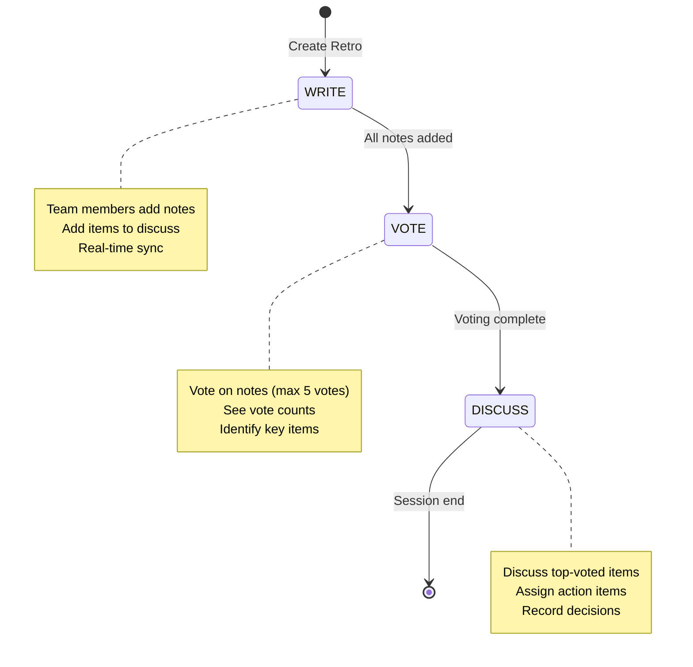
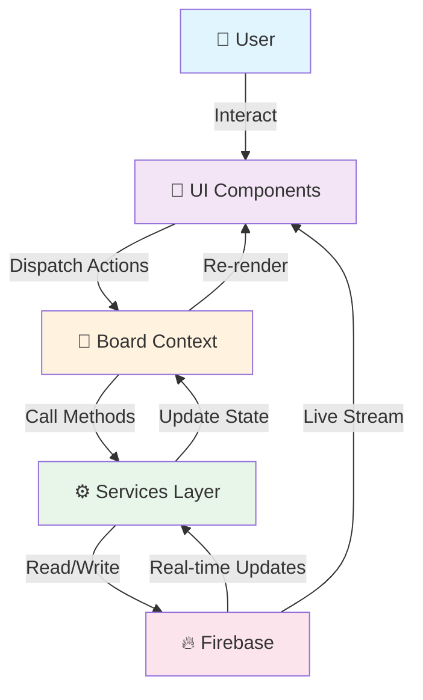
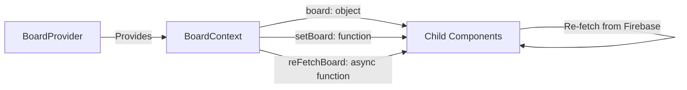
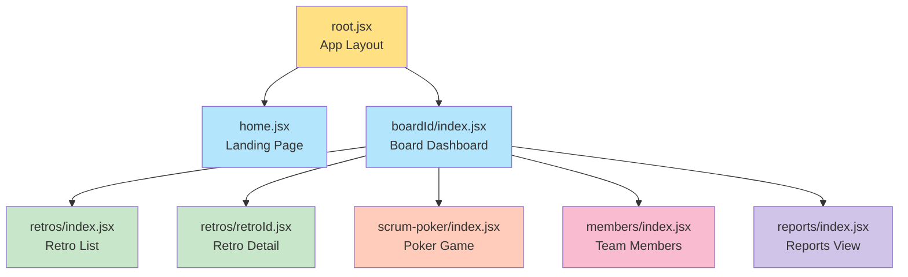

# 📋 OpenRetro - Free Retrospective & Scrum Poker Tool

## Project Overview

OpenRetro is a modern, collaborative web application designed to facilitate team retrospectives and agile estimation through Scrum Poker. Built with React and Vite, it provides a seamless, real-time experience for distributed and co-located teams to reflect on their work and make estimations together.

### Key Highlights
- **Real-time Collaboration**: Live updates across all team members using Firebase Realtime Database
- **Retrospective Meetings**: Structured Write-Vote-Discuss workflow for effective team reflection
- **Scrum Poker Estimation**: Interactive planning poker for agile estimation
- **Board Management**: Create and manage multiple retrospective/poker boards
- **Report Generation**: Export retrospectives as PDF reports
- **Analytics Integration**: Built-in Google Analytics for usage tracking
- **Responsive Design**: Mobile-friendly interface with Tailwind CSS
- **No Sign-up Required**: Quick board creation and joining via shareable links

---

## Architecture Overview

```
┌─────────────────────────────────────────────────────────────────┐
│                      React Application                          │
├─────────────────────────────────────────────────────────────────┤
│                          Router Layer                           │
│                    (React Router v6.17)                         │
├─────────────────────────────────────────────────────────────────┤
│                    Pages & Page Components                      │
├─────────────────────────────────────────────────────────────────┤
│  Components Layer (UI Components, Modals, Forms, Navigation)    │
├─────────────────────────────────────────────────────────────────┤
│  Context API (BoardProvider) - Global State Management          │
├─────────────────────────────────────────────────────────────────┤
│                      Services Layer                             │
│     (board, retro, notes, poker, member, pdf)                   │
├─────────────────────────────────────────────────────────────────┤
│                      Firebase Backend                           │
│  ┌──────────────────┐  ┌──────────────────┐  ┌──────────┐       │
│  │    Firestore     │  │  Realtime DB     │  │ Storage  │       │
│  │  (Documents)     │  │  (Live Updates)  │  │ (Files)  │       │
│  └──────────────────┘  └──────────────────┘  └──────────┘       │
│                        Google Analytics                         │
└─────────────────────────────────────────────────────────────────┘
```

---

## Project Structure

```
open-retro-react/
├── src/
│   ├── components/                 # Reusable UI components
│   │   ├── BaseAlert.jsx          # Alert notifications
│   │   ├── BaseButton.jsx         # Button component
│   │   ├── BaseConfirm.jsx        # Confirmation dialog
│   │   ├── BaseIcon.jsx           # Icon wrapper
│   │   ├── BaseModal.jsx          # Modal dialog
│   │   ├── BaseNavbar.jsx         # Navigation bar
│   │   ├── BaseFirstChar.jsx      # Avatar with first character
│   │   ├── About.jsx              # About section
│   │   ├── AddRetroBoard.jsx      # Add retrospective button
│   │   ├── CompanyCollaboration.jsx # Partner logos
│   │   ├── CountDownTimer.jsx     # Timer component
│   │   ├── EditNote.jsx           # Note editing
│   │   ├── GetAPreview.jsx        # Feature preview
│   │   ├── NewNote.jsx            # Note creation
│   │   ├── SideNavbar.jsx         # Side navigation
│   │   ├── TimerSlide.jsx         # Timer slider
│   │   └── form-inputs/           # Form input components
│   │       ├── BaseInput.jsx      # Text input
│   │       └── BaseTextarea.jsx   # Text area
│   │
│   ├── contexts/                  # State management
│   │   ├── BoardContext.jsx       # Board context definition
│   │   └── BoardProvider.jsx      # Board context provider
│   │
│   ├── helpers/                   # Utility functions
│   │   ├── constant.js            # App constants
│   │   └── icons.jsx              # Icon mappings
│   │
│   ├── page-components/           # Page-specific components
│   │   ├── Footer.jsx             # Footer component
│   │   └── boards/                # Board-related components
│   │       ├── CreateBoardModal.jsx   # Board creation
│   │       ├── JoinBoardModal.jsx     # Board joining
│   │       └── ShareBoardModal.jsx    # Board sharing
│   │   └── retros/                # Retro-specific components
│   │       └── NewRetroModal.jsx  # Retro creation
│   │
│   ├── pages/                     # Route pages
│   │   ├── home.jsx               # Home landing page
│   │   ├── root.jsx               # Root layout
│   │   └── boards/boardId/        # Board pages
│   │       ├── index.jsx          # Board overview
│   │       ├── members/           # Member management
│   │       │   └── index.jsx
│   │       ├── reports/           # Reports view
│   │       │   └── index.jsx
│   │       ├── retros/            # Retrospectives
│   │       │   ├── index.jsx      # Retros list
│   │       │   └── retroId.jsx    # Individual retro
│   │       └── scrum-poker/       # Scrum poker
│   │           └── index.jsx
│   │
│   ├── services/                  # API & Firebase services
│   │   ├── board.service.js       # Board operations
│   │   ├── member.service.js      # Member operations
│   │   ├── notes.service.js       # Note operations
│   │   ├── poker.service.js       # Poker voting
│   │   ├── pdf.service.js         # PDF generation
│   │   ├── retro.service.js       # Retro operations
│   │   └── stopwatch.service.js   # Timer operations
│   │
│   ├── utils/                     # Helper utilities
│   │   └── common.util.js         # Common utilities
│   │
│   ├── assets/                    # Static assets
│   │   └── images/                # Image files
│   │
│   ├── firebase.js                # Firebase configuration
│   ├── main.jsx                   # App entry point
│   ├── router.jsx                 # Route configuration
│   └── index.css                  # Global styles
│
├── public/
│   └── sitemap.xml                # SEO sitemap
│
├── vite.config.js                 # Vite configuration
├── tailwind.config.js             # Tailwind CSS config
├── postcss.config.js              # PostCSS config
├── package.json                   # Dependencies
└── index.html                     # HTML entry point
```

### Component Hierarchy Structure

| Component | Type | Purpose |
|-----------|------|---------|
| `root.jsx` | Layout | Main app wrapper with layout structure |
| `home.jsx` | Page | Landing page with board creation |
| `BoardId/index.jsx` | Page | Board dashboard with navigation |
| `Retros/index.jsx` | Page | List all retrospectives in a board |
| `RetroId.jsx` | Page | Individual retrospective view |
| `ScrumPoker/index.jsx` | Page | Scrum poker voting interface |
| `Members/index.jsx` | Page | Team members management |
| `Reports/index.jsx` | Page | Retro reports & analytics |
| `BaseModal.jsx` | Modal | Generic modal wrapper |
| `CreateBoardModal.jsx` | Modal | Create new board |
| `JoinBoardModal.jsx` | Modal | Join existing board |
| `BaseNavbar.jsx` | Navigation | Top navigation bar |
| `SideNavbar.jsx` | Navigation | Side navigation menu |

---

## Technology Stack

### Frontend Framework & Build
| Technology | Version | Purpose |
|------------|---------|---------|
| React | 18.2.0 | UI library |
| Vite | 4.4.5 | Build tool & dev server |
| React Router DOM | 6.17.0 | Client-side routing |
| ESLint | 8.45.0 | Code linting |

### Styling & UI
| Technology | Version | Purpose |
|------------|---------|---------|
| Tailwind CSS | 3.3.5 | Utility-first CSS framework |
| PostCSS | 8.4.31 | CSS processing |
| Autoprefixer | 10.4.16 | CSS vendor prefixes |
| Headless UI | 1.7.18 | Unstyled accessible components |
| Heroicons | 2.1.1 | Icon library |

### Backend & Database
| Technology | Version | Purpose |
|------------|---------|---------|
| Firebase | 10.8.1 | Backend services |
| Firestore | Included | Document database |
| Realtime Database | Included | Real-time data sync |
| Firebase Storage | Included | File storage |
| Google Analytics | v4 | Usage tracking |

### Utilities
| Technology | Version | Purpose |
|------------|---------|---------|
| React Toastify | 10.0.4 | Toast notifications |
| jsPDF | 2.5.1 | PDF generation |
| html2canvas | 1.4.1 | HTML to canvas conversion |
| Lodash.get | 4.4.2 | Safe object property access |

---

## Features Overview

### 🎯 Core Feature Sets

1. **Retrospective Management**
   - Create retrospectives with customizable titles
   - Three-phase workflow: Write → Vote → Discuss
   - Real-time note updates for all participants
   - Vote on notes with configurable vote limits
   - Track action items and discussions

2. **Scrum Poker Estimation**
   - Interactive voting cards
   - Real-time vote display and counting
   - Vote reveal mechanism
   - Vote history and updates
   - Multi-story estimation flow

3. **Board Management**
   - Create unlimited retrospective/poker boards
   - Share boards via unique URLs
   - Board member management
   - Owner assignment and permissions
   - Archived/active board tracking

4. **Report Generation**
   - Export retrospectives as PDF documents
   - Visual report layout with HTML-to-PDF conversion
   - Cloud storage integration
   - Report archival and retrieval

5. **Real-time Collaboration**
   - WebSocket-based real-time updates via Firebase
   - Multi-user simultaneous participation
   - Live member presence tracking
   - Instant vote synchronization

6. **User Experience**
   - No authentication required
   - Responsive mobile design
   - Intuitive modal-based workflows
   - Toast notifications for feedback
   - Timer functionality for time-boxed activities

---

## Core Features Breakdown

### 1. Retrospective Workflow



### 2. Data Flow Architecture



### 3. Board Context Flow



---

## Component Hierarchy

### Page Structure


---

## State Management

### Context API Structure

**BoardContext** manages global board state:

```javascript
{
  board: {
    id: string,
    name: string,
    owner: string,
    createdDate: timestamp,
    members: string[],
    // ... other board properties
  },
  setBoard: (board) => void,
  reFetchBoard: async ({ boardId }) => void
}
```

### State Flow Pattern

1. **Component mounts** → Fetch board data from Firebase
2. **User interaction** → Component calls service method
3. **Service updates** → Firebase DB updated
4. **Firebase fires** → Real-time listener triggers
5. **Context updates** → `setBoard()` called
6. **Components re-render** → Using updated context

### State Update Patterns

```
User Action
    ↓
Component State/Hook
    ↓
Service Method Call
    ↓
Firebase Operation (Firestore/RTDB)
    ↓
Real-time Listener Triggered
    ↓
Context Updated via setBoard()
    ↓
Components Re-render (useContext)
```

---

## Data Models

### Board Model
```javascript
{
  id: string,              // Document ID
  name: string,            // Board display name
  owner: string,           // Owner user ID
  createdDate: timestamp,  // Creation timestamp
  members: string[],       // Array of member IDs
  description: string      // Optional board description
}
```

### Retrospective Model
```javascript
{
  id: string,                // Document ID
  boardId: string,           // Parent board ID
  title: string,             // Retro title
  createdDate: timestamp,    // Creation timestamp
  createdBy: string,         // Creator user ID
  state: enum,               // WRITE | VOTE | DISCUSS
  notes: Note[],             // Array of notes
  reportSrcPath: string      // PDF storage path
}
```

### Note Model
```javascript
{
  id: string,                // Document ID
  retroId: string,           // Parent retro ID
  content: string,           // Note text
  category: enum,            // went well | improvements | action items
  createdBy: string,         // Creator user ID
  createdDate: timestamp,    // Creation timestamp
  votes: number              // Vote count
}
```

### Poker Vote Model
```javascript
{
  id: string,                // Vote ID
  boardId: string,           // Board ID
  memberId: string,          // Voting member
  point: number,             // Story point estimate
  createdDate: timestamp     // Vote timestamp
}
```

### Member Model
```javascript
{
  id: string,                // Member ID
  boardId: string,           // Board ID
  name: string,              // Member name
  email: string,             // Member email
  joinedDate: timestamp      // Join timestamp
}
```

---

## API Integration

### Firebase Firestore (Document Database)

**Collections Structure:**
```
boards/
├── {boardId}/
│   ├── Collection: retros
│   │   ├── {retroId}/
│   │   │   ├── Collection: notes
│   │   │   │   └── {noteId}/
│   │   │   └── metadata
│   └── metadata
```

### Service Methods

#### Board Service
| Method | Type | Purpose |
|--------|------|---------|
| `createBoard(formBody)` | POST | Create new board |
| `getBoard({ boardId })` | GET | Fetch board details |
| `updateBoardOwner()` | PATCH | Change board owner |

#### Retro Service
| Method | Type | Purpose |
|--------|------|---------|
| `createRetro({ boardId }, formBody)` | POST | Create retrospective |
| `getRetro({ boardId, retroId })` | GET | Fetch retro details |
| `getBoardRetros({ boardId })` | GET | List board's retros |
| `deleteRetro(boardId, retroId)` | DELETE | Remove retro |
| `updateRetroState({ retroId }, { stage })` | PATCH | Change retro phase |
| `updateRetroReportSrc()` | PATCH | Store PDF path |
| `listenRetroStageChange()` | LISTEN | Real-time phase updates |

#### Poker Service
| Method | Type | Purpose |
|--------|------|---------|
| `pokerVote({ boardId }, { memberId, point })` | POST | Cast vote |
| `updatePokerVote()` | PATCH | Update vote value |
| `deleteAllPokerVote()` | DELETE | Clear all votes |
| `updatePokerState()` | PATCH | Show/hide votes |
| `listenVoteChange()` | LISTEN | Real-time vote updates |
| `listenPokerStateChange()` | LISTEN | Real-time state changes |

#### Notes Service
| Method | Type | Purpose |
|--------|------|---------|
| `createNote()` | POST | Add retro note |
| `updateNote()` | PATCH | Edit note |
| `deleteNote()` | DELETE | Remove note |
| `getNotesByRetro()` | GET | Fetch retro notes |

#### PDF Service
| Method | Type | Purpose |
|--------|------|---------|
| `generateAndUploadPdf()` | POST | Convert HTML to PDF and upload |

#### Member Service
| Method | Type | Purpose |
|--------|------|---------|
| `addMember()` | POST | Add board member |
| `getMembers()` | GET | List board members |
| `removeMember()` | DELETE | Remove member |

### Firebase Realtime Database

**Real-time Data Paths:**
```
retro-state/{retroId}/
├── stage: "WRITE" | "VOTE" | "DISCUSS"

poker-state/{boardId}/
├── show: boolean

votes/{boardId}/{voteId}/
├── memberId: string
├── point: number
├── createdDate: timestamp
```

### Real-time Listeners

Implemented through Firebase `onValue()` callbacks:
- Retro phase changes → Updates UI automatically
- Poker votes → Live vote display
- State visibility → Show/hide poker cards

---

## Technical Implementation Details

### Routing Configuration

```javascript
// src/router.jsx
[
  {
    path: "/",
    element: <Root />,
    children: [
      { path: "/", element: <Home /> },
      {
        path: "/boards/:boardId",
        element: <BoardId />,
        children: [
          { path: "reports", element: <Reports /> },
          { path: "retros", element: <Retros /> },
          { path: "retros/:retroId", element: <RetroId /> },
          { path: "scrum-poker", element: <ScrumPoker /> },
          { path: "members", element: <Members /> }
        ]
      }
    ]
  }
]
```

### Entry Point Setup

```javascript
// src/main.jsx
ReactDOM.createRoot(document.getElementById("root")).render(
  <BoardProvider>
    <RouterProvider router={router} />
  </BoardProvider>
);
```

### Environment Configuration

```javascript
// Firebase Configuration via environment variables
VITE_FIRBASE_API_KEY
VITE_FIRBASE_AUTH_DOMAIN
VITE_FIRBASE_PROJECT_ID
VITE_FIRBASE_STORAGE_BUCKET
VITE_FIRBASE_MESSAGING_SENDER_ID
VITE_FIRBASE_APP_ID
VITE_FIRBASE_MEASUREMENT_ID
VITE_FIRBASE_DATABASE_URL
```

### Analytics Integration

```javascript
// src/firebase.js - Google Analytics initialization
ReactGA.initialize(VITE_FIRBASE_MEASUREMENT_ID);
ReactGA.send({ hitType: "pageview", page: window.location.pathname });

// Custom events
logCreateCardAnalytics() // Track board creation
logSignUpAnalytics()     // Track user signup
```

---

## Design System

### Color Palette (Tailwind)

| Usage | Colors |
|-------|--------|
| **Background** | `bg-zinc-950` (dark), `bg-zinc-100` (light) |
| **Primary CTA** | `bg-gradient-to-r from-blue-500 to-pink-600` |
| **Accents** | `text-pink-500`, `text-blue-500`, `text-yellow-500` |
| **Text** | `text-zinc-100` (on dark), `text-zinc-900` (on light) |
| **Borders** | `border-zinc-700`, `border-gray-200` |

### Component Patterns

1. **Base Components** - Reusable UI primitives
   - `BaseButton` - Styled button
   - `BaseInput` - Form input
   - `BaseModal` - Dialog container
   - `BaseIcon` - Icon wrapper

2. **Feature Components** - Domain-specific features
   - `CreateBoardModal` - Board creation
   - `CountDownTimer` - Time-boxed sessions
   - `EditNote` - Note management

3. **Page Components** - Route-level components
   - Dashboard views
   - List views
   - Detail views

### Typography
- **Headings**: Bold, tracking-wider, variable sizes
- **Body**: Regular weight, `text-zinc-200` on dark backgrounds
- **UI Text**: Semi-bold for buttons and labels

---

## Responsive Design Strategy

### Breakpoints Used

| Breakpoint | Screen Size | Purpose |
|------------|------------|---------|
| `sm` | 640px | Small phones |
| `md` | 768px | Tablets |
| `lg` | 1024px | Laptops |
| `xl` | 1280px | Large screens |

### Responsive Patterns

```html
<!-- Mobile-first approach -->
<div class="flex flex-col lg:flex-row">
  <!-- Single column on mobile, row on desktop -->
</div>

<div class="w-full md:w-1/2">
  <!-- Full width mobile, half width on tablet+ -->
</div>

<h1 class="text-3xl md:text-5xl">
  <!-- Smaller on mobile, larger on desktop -->
</h1>
```

### Mobile Considerations
- Touch-friendly button sizes (min 48px)
- Readable text sizes on small screens
- Modal-first approach for forms
- Vertical scrolling layouts for mobile
- Responsive navigation (Navbar ↔ SideNavbar)

---

## Performance Optimizations

### Current Optimizations

1. **Build Optimization**
   - Vite for fast development and optimized production builds
   - Code splitting via React Router lazy loading
   - CSS optimization with Tailwind's purging

2. **Runtime Performance**
   - React 18's concurrent rendering
   - Component memoization where needed
   - Efficient state updates via Context API

3. **Real-time Updates**
   - Targeted Firestore queries with proper indexing
   - RTDB listeners for time-critical data
   - Event-based updates instead of polling

### Recommended Future Optimizations

- Implement `React.memo()` for expensive components
- Add code splitting with `React.lazy()` for routes
- Optimize images with WebP format
- Implement service workers for offline support
- Add component lazy loading with Suspense
- Database query optimization and caching

---

## Testing Strategy

### Current Testing Approach
- Manual testing during development
- ESLint for code quality checks

### Recommended Testing Implementation

```javascript
// Unit Tests (Jest + React Testing Library)
- Component rendering tests
- Service/utility function tests
- Context/hook tests

// Integration Tests
- User workflow tests (create board → add notes → vote)
- Firebase integration tests
- Modal/form submission tests

// E2E Tests (Cypress)
- Complete user journeys
- Cross-browser compatibility
- Mobile responsiveness
```

### Testing File Structure
```
__tests__/
├── components/
│   ├── BaseButton.test.jsx
│   └── BaseModal.test.jsx
├── services/
│   ├── board.service.test.js
│   └── retro.service.test.js
├── pages/
│   └── home.test.jsx
└── integration/
    └── retro-workflow.test.js
```

---

## Development Workflow

### Setup & Installation

```bash
# Clone repository
git clone <repo-url>
cd open-retro-react

# Install dependencies
npm install

# Create .env.local file with Firebase credentials
# Copy environment variables from .env.example

# Start development server
npm run dev
```

### Available Scripts

| Script | Purpose |
|--------|---------|
| `npm run dev` | Start Vite dev server (HMR enabled) |
| `npm run build` | Production build |
| `npm run build-stg` | Staging build |
| `npm run lint` | Run ESLint on all JS/JSX files |
| `npm run preview` | Preview production build locally |

### Development Workflow Steps

```
1. Create feature branch
   git checkout -b feature/feature-name

2. Make changes & test locally
   npm run dev
   npm run lint

3. Commit changes
   git add .
   git commit -m "feat: description"

4. Push to branch
   git push origin feature/feature-name

5. Create Pull Request
   - Link to related issues
   - Add description and testing notes

6. Code review & merge
   - Address review comments
   - Update branch if needed
   - Squash merge to main
```

---

## Development Guidelines

### Code Organization

- **Components**: Keep components focused and single-purpose
- **Services**: Handle all API/Firebase calls
- **Contexts**: Use for truly global state only
- **Utils**: Pure functions and helpers
- **Constants**: Centralized app-wide constants

### Naming Conventions

```javascript
// Components: PascalCase
function CreateBoardModal() {}

// Files: kebab-case
create-board-modal.jsx

// Functions/vars: camelCase
const handleSubmit = () => {}

// Constants: UPPER_SNAKE_CASE
const MAX_RETRO_VOTES_ALLOWED = 5;

// Context: Descriptive names
const BoardContext = createContext();
```

### Firebase Best Practices

1. **Query Optimization**
   - Use `where()` clauses to filter at database
   - Order results in database, not in app
   - Limit document reads with `limit()`

2. **Real-time Listeners**
   - Clean up listeners on component unmount
   - Use specific paths to avoid large data transfers
   - Implement error handling for connection loss

3. **Data Structure**
   - Denormalize where necessary for query efficiency
   - Use subcollections for nested data (retros → notes)
   - Keep documents under 1MB

### Component Best Practices

```javascript
// Good: Clear props and defaults
function Modal({ title, isOpen, onClose, children }) {
  // ...
}

// Good: Proper hooks usage
function Board() {
  const [board, setBoard] = useContext(BoardContext);
  const [loading, setLoading] = useState(false);
  
  useEffect(() => {
    // Setup and cleanup
  }, []);
}

// Avoid: Silent failures
try {
  // operation
} catch (e) {
  // Always log or notify user
  console.error(e);
  showErrorToast("Operation failed");
}
```

### Styling Guidelines

- Use Tailwind utility classes (no custom CSS unless necessary)
- Mobile-first approach for responsive design
- Maintain consistent spacing using Tailwind scale
- Use CSS variables for theme customization (if needed)

---

## Future Enhancements

### Feature Ideas

| Priority | Feature | Description |
|----------|---------|-------------|
| **High** | User Authentication | Sign in/out, user profiles, board sharing permissions |
| **High** | Action Item Tracking | Follow-up on decisions with due dates and assignees |
| **High** | Timer Management | Configurable time limits for each retro phase |
| **Medium** | Retro Templates | Pre-built templates (Start-Stop-Continue, MAD SAD GLAD) |
| **Medium** | Export Options | CSV export, email reports, Slack integration |
| **Medium** | Team Insights | Analytics dashboard with trends over time |
| **Low** | Themes | Dark/light mode toggle, custom color schemes |
| **Low** | Integrations | Jira, Slack, Google Workspace, Trello |
| **Low** | Mobile App | Native mobile apps using React Native |

### Technical Debt & Refactoring

1. **Testing**
   - Add unit tests with Jest
   - Add E2E tests with Cypress
   - Achieve 80%+ code coverage

2. **Code Quality**
   - Extract duplicated logic into utils
   - Reduce component complexity with custom hooks
   - Improve error handling and validation

3. **Performance**
   - Implement virtualization for large lists
   - Add image optimization
   - Implement aggressive caching strategies

4. **Documentation**
   - Create Storybook for component library
   - Add API documentation
   - Create video tutorials

### Infrastructure

- Implement CI/CD pipeline (GitHub Actions)
- Set up automated testing on pull requests
- Add deployment automation
- Implement error tracking (Sentry)
- Add performance monitoring (Web Vitals)

---

## Key Learning Points

### Architecture Decisions

1. **Context API over Redux**
   - Simpler for this project's complexity
   - Sufficient for current state management needs
   - Avoids boilerplate code

2. **Firebase for Backend**
   - No backend maintenance required
   - Real-time capabilities built-in
   - Scales automatically

3. **Vite over Create React App**
   - Faster development experience (HMR)
   - Modern tooling and configuration
   - Smaller final bundle size

4. **Tailwind CSS**
   - Rapid UI development
   - Consistent design system
   - Easy responsive design implementation

### Technical Insights

1. **Real-time Synchronization**
   - Use Firestore for persistent data
   - Use RTDB for ephemeral state (votes, phases)
   - Implement proper cleanup of listeners

2. **Collaborative Features**
   - Optimistic updates for better UX
   - Last-write-wins conflict resolution
   - Consider eventual consistency model

3. **Component Design**
   - Modals work well for no-auth flows
   - Share state via Context for features
   - Keep components as pure as possible

### Common Patterns Used

```javascript
// Service layer pattern
export default {
  async operation(params) {
    // Handle Firebase operations
    return result;
  },
  listenForChanges(params, callback) {
    // Real-time listeners
    return unsubscribe;
  }
}

// Context pattern
const [state, setState] = useState();
const updateState = async (newState) => {
  setState(newState);
  await service.update(newState);
};

// Modal pattern
const [isOpen, setIsOpen] = useState(false);
return (
  <>
    <Button onClick={() => setIsOpen(true)}>Open</Button>
    <Modal isOpen={isOpen} onClose={() => setIsOpen(false)}>
      {/* Modal content */}
    </Modal>
  </>
);
```

---

## Getting Started

### Prerequisites
- Node.js 16+
- npm or yarn
- Git

### Installation

```bash
# 1. Clone the repository
git clone https://github.com/yourname/open-retro-react.git
cd open-retro-react

# 2. Install dependencies
npm install

# 3. Create environment file
cp .env.example .env.local

# 4. Add your Firebase credentials to .env.local
# VITE_FIRBASE_API_KEY=...
# VITE_FIRBASE_PROJECT_ID=...
# etc.

# 5. Start development server
npm run dev

# 6. Open http://localhost:5173 in your browser
```

### Building for Production

```bash
# Build for production
npm run build

# Preview production build
npm run preview

# Deploy to hosting (Vercel, Netlify, Firebase Hosting)
```

---

## Contributing

1. Fork the repository
2. Create a feature branch (`git checkout -b feature/amazing-feature`)
3. Commit your changes (`git commit -m 'Add amazing feature'`)
4. Push to the branch (`git push origin feature/amazing-feature`)
5. Open a Pull Request

### Code Standards
- Follow existing code style
- Run `npm run lint` before submitting PR
- Add tests for new features
- Update documentation as needed

---

## License

This project is open source and available under the MIT License.

---

## Support & Resources

- **Issues**: Report bugs on GitHub Issues
- **Discussions**: Join our GitHub Discussions for feature requests
- **Documentation**: See [docs](./docs) folder for additional guides
- **Firebase Docs**: https://firebase.google.com/docs
- **React Docs**: https://react.dev
- **Tailwind Docs**: https://tailwindcss.com/docs

---

**Last Updated**: May 2026
**Project Version**: 0.2.2
