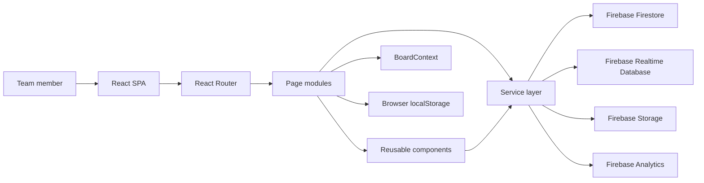
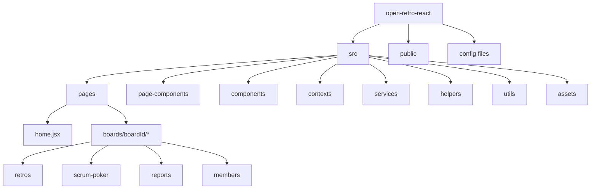
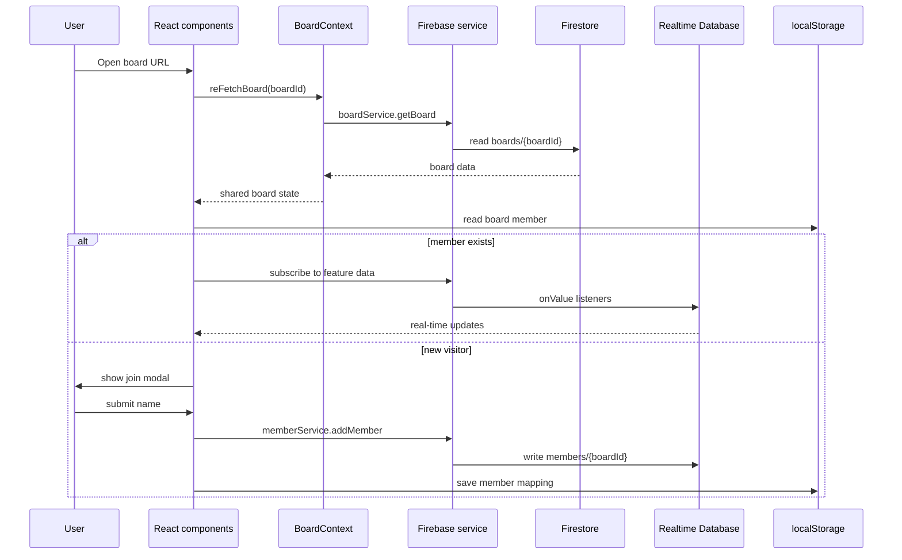
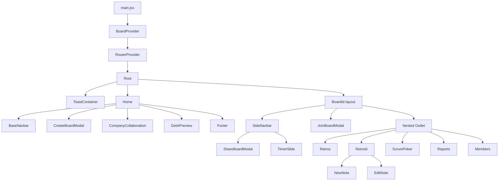
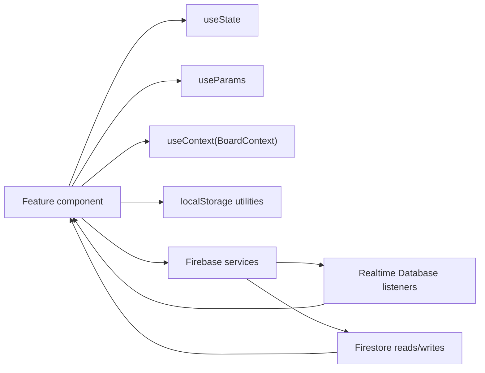
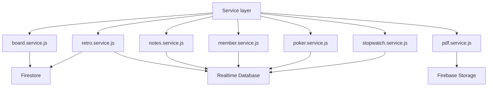
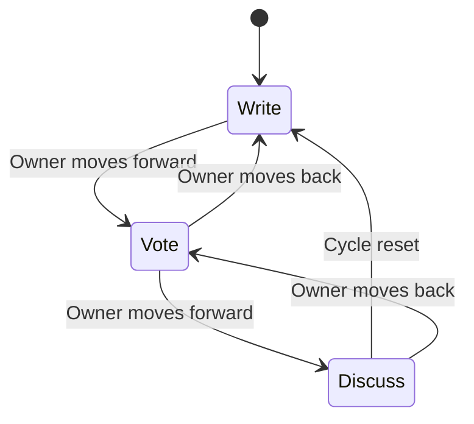
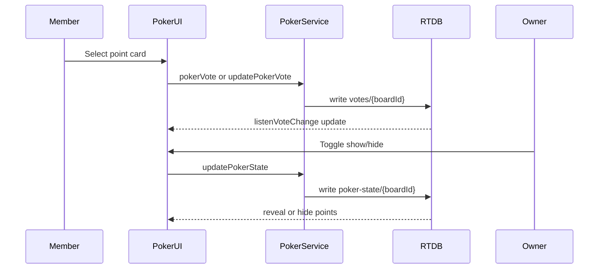
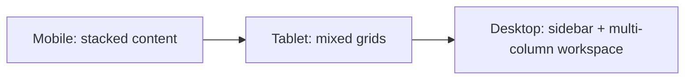

# Open Retro React

Open Retro React is a real-time agile collaboration app for creating retrospective boards, collecting team feedback, running scrum poker sessions, tracking members, generating PDF reports, and sharing board access through a simple URL/QR workflow.

## Architecture Overview

The application is a Vite + React single page app. React Router owns navigation, Firebase provides persistence and real-time synchronization, and reusable UI primitives keep the board, retro, poker, report, and member screens consistent.



## Project Structure

| Path | Purpose |
| --- | --- |
| `src/main.jsx` | React entry point, Google Analytics setup, router/provider mounting. |
| `src/router.jsx` | Route tree for home, boards, retros, reports, scrum poker, and members. |
| `src/firebase.js` | Firebase initialization for Firestore, Realtime Database, and Analytics. |
| `src/pages/` | Route-level screens and nested board pages. |
| `src/page-components/` | Feature-specific components such as create/join/share board modals and retro modal. |
| `src/components/` | Shared UI primitives and reusable widgets. |
| `src/components/form-inputs/` | Form input primitives. |
| `src/contexts/` | Board context and provider for shared board state. |
| `src/services/` | Firebase-facing service modules. |
| `src/helpers/` | Constants and icon mapping helpers. |
| `src/utils/` | Local storage and formatting utilities. |
| `src/assets/` | Static images and SVG assets used by the UI. |
| `public/` | Static public files such as favicon, robots, and sitemap. |
| `.env.staging`, `.env.production` | Firebase environment configuration by build mode. |



## Technology Stack

| Area | Technology | Usage |
| --- | --- | --- |
| Build tool | Vite 4 | Development server, optimized production builds, environment modes. |
| UI framework | React 18 | Component-driven SPA UI. |
| Routing | React Router DOM 6 | Nested routes for board sections. |
| Styling | Tailwind CSS 3 | Utility-first responsive design. |
| UI behavior | Headless UI | Accessible modals, dialogs, and transitions. |
| Icons | Heroicons | SVG icon components and reusable icon wrapper. |
| Database | Firebase Firestore | Board and retro metadata. |
| Real-time sync | Firebase Realtime Database | Notes, members, votes, poker state, retro stage, stopwatch state. |
| File storage | Firebase Storage | Generated PDF retro reports. |
| Analytics | Firebase Analytics, React GA4 | Pageview and board/sign-up event tracking. |
| PDF generation | html2canvas, jsPDF | Converts retro board DOM into PDF. |
| Utility | lodash.get | Safe nested vote access. |
| Notifications | React Toastify | Success and error feedback. |
| Quality | ESLint | React linting and hook rules. |

## Features

| Feature | Description | Main Files |
| --- | --- | --- |
| Landing page | Marketing/home entry with create-board action and previews. | `src/pages/home.jsx` |
| Board creation | Creates a board, creates owner member, stores local member session, redirects to board. | `CreateBoardModal.jsx`, `board.service.js`, `member.service.js` |
| Board joining | Prompts unknown visitors to enter a name before accessing a board. | `JoinBoardModal.jsx`, `BoardId/index.jsx` |
| Retro sessions | Create retros, add/edit/delete notes, vote, discuss, and generate reports. | `retros/index.jsx`, `retroId.jsx`, `notes.service.js` |
| Scrum poker | Team estimation cards with hidden/revealed votes and owner reset/show controls. | `scrum-poker/index.jsx`, `poker.service.js` |
| Members | Lists board participants. | `members/index.jsx`, `member.service.js` |
| Reports | Lists retros with generated reports and opens uploaded PDFs. | `reports/index.jsx`, `pdf.service.js` |
| Stopwatch | Owner-controlled real-time timer for board activities. | `TimerSlide.jsx`, `stopwatch.service.js` |
| Sharing | Board share modal and QR code support. | `ShareBoardModal.jsx`, `constant.js` |

## Core Features Breakdown

| Domain | User Action | Client Behavior | Persistence |
| --- | --- | --- | --- |
| Board | Create board | Saves board, adds creator as member, marks owner, stores member locally. | Firestore `boards`, RTDB `members`, localStorage `boardMember` |
| Retro | Create retro | Adds retro metadata under selected board. | Firestore `boards/{boardId}/retros` |
| Retro notes | Add/edit/delete note | Writes notes by retro ID and streams updates to all participants. | RTDB `notes/{retroId}` |
| Retro stage | Move write/vote/discuss | Owner updates current stage, listeners update UI. | RTDB `retro-state/{retroId}` |
| Voting | Vote on retro notes | Stores member vote per note and recalculates totals client-side. | RTDB `notes/{retroId}/{noteId}/members` |
| Poker | Select estimate | Creates or updates the current member vote. | RTDB `votes/{boardId}` |
| Poker reveal | Show/hide estimates | Owner toggles reveal state. | RTDB `poker-state/{boardId}` |
| Timer | Start/clear timer | Owner writes runtime and start timestamp; clients compute remaining seconds. | RTDB `stopwatch-state/{boardId}` |
| Reports | Generate PDF | Captures board DOM, uploads PDF, stores report path on retro. | Firebase Storage, Firestore retro `reportSrcPath` |

## Data Flow Architecture



## Component Hierarchy



## State Management

| State Type | Location | Data | Notes |
| --- | --- | --- | --- |
| Global board state | `BoardContext` / `BoardProvider` | Current board object, `setBoard`, `reFetchBoard`. | Keeps nested board pages aligned. |
| Route params | React Router | `boardId`, `retroId`. | Used by page components to scope service calls. |
| Local component state | `useState` | Modal open state, forms, lists, vote maps, retro stage, timer state. | Kept close to the feature UI. |
| Real-time server state | Firebase RTDB listeners | Notes, members, votes, poker state, retro state, stopwatch state. | Updated with `onValue` subscriptions. |
| Persistent browser identity | localStorage | Current member and per-board member mapping. | Avoids requiring authentication. |
| Notifications | React Toastify | Success/error messages. | Mounted once in `Root`. |



## Data Models

| Model | Stored At | Key Fields | Used By |
| --- | --- | --- | --- |
| Board | Firestore `boards/{boardId}` | `boardName`, `createdBy`, `createdDate`, `createdDateUI`, `owner` | Board layout, sharing, owner controls. |
| Member | RTDB `members/{boardId}/{memberId}` | `name`, `createdDate` | Join flow, member list, poker participants, vote ownership. |
| Retro | Firestore `boards/{boardId}/retros/{retroId}` | `retroName`, `createdDate`, `retroState`, `reportSrcPath` | Retros list, retro board, reports. |
| Note | RTDB `notes/{retroId}/{noteId}` | `description`, `tagName`, `members`, `createdDate` | Retro columns, voting, discussion sorting. |
| Note vote | Nested under note `members/{memberId}` | `vote` | Retro vote count and remaining votes. |
| Poker vote | RTDB `votes/{boardId}/{voteId}` | `memberId`, `point`, `createdDate` | Scrum poker cards and reveal list. |
| Poker state | RTDB `poker-state/{boardId}` | `show` | Hide/reveal estimates. |
| Retro state | RTDB `retro-state/{retroId}` | `stage` | Write, Vote, Discuss workflow. |
| Stopwatch state | RTDB `stopwatch-state/{boardId}` | `startTime`, `runtime` | Shared countdown timer. |

## API Integration

| Service | Backend | Responsibilities |
| --- | --- | --- |
| `board.service.js` | Firestore | Create board, update owner, fetch board. |
| `retro.service.js` | Firestore + RTDB | CRUD retro metadata, store report path, sync retro stage. |
| `notes.service.js` | RTDB | Create notes, edit descriptions, vote, delete notes, listen for changes. |
| `member.service.js` | RTDB | Add members, fetch members once, listen for member changes. |
| `poker.service.js` | RTDB | Create/update poker votes, reset votes, listen to votes, sync reveal state. |
| `stopwatch.service.js` | RTDB | Start and clear shared stopwatch state, subscribe to timer changes. |
| `pdf.service.js` | Firebase Storage | Capture HTML as PDF and upload generated reports. |



## Key Features Breakdown

### Retrospective Workflow



| Stage | Behavior |
| --- | --- |
| Write | Members add new notes to Went Well, To Improve, and Action Item columns. |
| Vote | New notes are hidden; members vote on notes with a maximum vote allowance. |
| Discuss | Notes are sorted by total votes so the team can discuss the highest-priority items first. |

### Scrum Poker Workflow



## Technical Implementation

| Concern | Implementation |
| --- | --- |
| Module imports | Vite alias `@` maps to `src`, reducing relative import depth. |
| Route layout | `Root` hosts the toast system; `BoardId` hosts shared sidebar and board access control. |
| Board authorization style | Lightweight member identity is stored in localStorage instead of full Firebase Authentication. |
| Real-time updates | Firebase RTDB `onValue` listeners push live note, member, vote, stage, poker, and timer changes. |
| Owner permissions | Owner-only controls are checked by comparing `board.owner` with the locally stored member ID. |
| PDF export | `html2canvas` captures the retro DOM, `jsPDF` creates an A4 PDF, and Firebase Storage stores the file. |
| Analytics | App initializes React GA4 and logs Firebase Analytics events for board creation and sign-up flow. |
| Feedback | Async actions report results through `react-toastify`. |

## Design System

| Design Element | Current Pattern |
| --- | --- |
| Theme | Dark zinc-based interface with blue accents for active states and primary workflow indicators. |
| Layout | Tailwind containers, responsive grids, flex layouts, sticky sidebar on desktop. |
| Buttons | Centralized `BaseButton` with theme, size, radius, disabled, and loading states. |
| Modals | `BaseModal` wraps Headless UI Dialog/Transition for accessible overlays. |
| Icons | `BaseIcon` and Heroicons provide consistent icon rendering. |
| Forms | `BaseInput` and `BaseTextarea` standardize input styling. |
| Notifications | Toasts appear bottom-right with a short auto-close duration. |
| Cards | Retros, members, poker cards, and report tiles use compact rounded zinc panels. |

## Responsive Design

| Viewport | Behavior |
| --- | --- |
| Mobile | Board navigation becomes horizontal, retro columns stack, home hero stacks vertically, modals use compact padding. |
| Tablet | Grid columns expand where space allows, with medium breakpoints for retro and poker layouts. |
| Desktop | Board sidebar becomes sticky and vertical; retro columns show in three columns; poker area splits between cards and members. |



## Performance Optimizations

| Optimization | Where |
| --- | --- |
| Vite development and production build pipeline | `vite.config.js`, npm scripts. |
| Code is organized by route and feature | `src/pages`, `src/page-components`, `src/services`. |
| Firebase reads are scoped by board or retro ID | Service modules. |
| Real-time listeners target narrow RTDB paths | Notes, members, votes, state, stopwatch services. |
| Local storage avoids repeated member onboarding | `common.util.js`. |
| Client-side vote maps reduce repeated lookups | Scrum poker page. |
| PDF generation only runs on demand | Retro detail page. |

## Testing

Current quality gates are linting and production build validation.

| Command | Purpose |
| --- | --- |
| `npm run lint` | Runs ESLint across `.js` and `.jsx` files. |
| `npm run build` | Builds the production bundle with Vite. |
| `npm run build-stg` | Builds with Vite staging mode. |
| `npm run preview` | Serves the production build locally. |

Recommended future test coverage:

| Test Type | Suggested Tools | Priority |
| --- | --- | --- |
| Component tests | React Testing Library, Vitest | High |
| Service tests | Vitest with Firebase mocks/emulator | High |
| Integration tests | Firebase Emulator Suite | Medium |
| End-to-end tests | Playwright | Medium |
| Accessibility checks | axe, Testing Library queries | Medium |

## Future Enhancements

| Enhancement | Value |
| --- | --- |
| Firebase Authentication | Stronger identity, secure ownership, and cross-device continuity. |
| Firebase security rules review | Protect board, member, note, vote, and report data. |
| Listener cleanup | Return and call unsubscribe functions from RTDB listeners to avoid stale subscriptions. |
| Dedicated test suite | Reduce regression risk around real-time collaboration flows. |
| Report download action | Complete the visible Download button in the reports screen. |
| Empty/error states | Improve failure handling for missing boards, deleted retros, and storage failures. |
| TypeScript migration | Make data models and service contracts safer. |
| Vote rule enforcement | Enforce `MAX_RETRO_VOTES_ALLOWED` at action level, not only display level. |
| Environment documentation | Add `.env.example` with placeholder Firebase keys. |
| Accessibility pass | Strengthen labels, focus management, keyboard navigation, and contrast checks. |

## Development Workflow

### Prerequisites

| Requirement | Version / Notes |
| --- | --- |
| Node.js | Use a modern LTS version compatible with Vite 4. |
| npm | Used by the existing `package-lock.json`. |
| Firebase project | Required for Firestore, Realtime Database, Storage, and Analytics. |

### Setup

```bash
npm install
npm run dev
```

### Environment Variables

Create environment files for the build modes you use. The project currently reads these Vite variables:

| Variable | Purpose |
| --- | --- |
| `VITE_FIRBASE_API_KEY` | Firebase API key. |
| `VITE_FIRBASE_AUTH_DOMAIN` | Firebase auth domain. |
| `VITE_FIRBASE_PROJECT_ID` | Firebase project ID. |
| `VITE_FIRBASE_STORAGE_BUCKET` | Firebase Storage bucket. |
| `VITE_FIRBASE_MESSAGING_SENDER_ID` | Firebase sender ID. |
| `VITE_FIRBASE_APP_ID` | Firebase app ID. |
| `VITE_FIRBASE_MEASUREMENT_ID` | Analytics measurement ID. |
| `VITE_FIRBASE_DATABASE_URL` | Realtime Database URL. |

Note: the variable names currently use `FIRBASE` in the code, so keep that spelling unless the code is renamed.

### Common Commands

| Command | Description |
| --- | --- |
| `npm run dev` | Start local development server. |
| `npm run build` | Create production build. |
| `npm run build-stg` | Create staging build. |
| `npm run lint` | Run ESLint. |
| `npm run preview` | Preview built app locally. |

## Key Learning Points

| Topic | Takeaway |
| --- | --- |
| Real-time collaboration | Firebase RTDB is useful for high-frequency collaborative state such as votes, notes, members, and timers. |
| Data separation | Firestore works well for document metadata, while RTDB handles live session state. |
| Context usage | React Context can share board-level data without a larger state library. |
| Feature organization | Separating pages, page-components, components, and services keeps feature work easier to locate. |
| Lightweight onboarding | localStorage can support no-login collaboration, but it should be paired with security rules for production-grade access. |
| PDF generation | Browser DOM capture is fast to implement, but layout and cross-browser rendering should be tested carefully. |

## Development Guidelines

| Guideline | Recommendation |
| --- | --- |
| Add new Firebase calls in services | Keep backend integration out of UI components where possible. |
| Scope real-time paths tightly | Subscribe to `boardId` or `retroId` paths instead of broad root paths. |
| Clean up subscriptions | Prefer returning unsubscribe callbacks from listener helpers and calling them in `useEffect` cleanup. |
| Keep UI primitives reusable | Extend `BaseButton`, `BaseModal`, and form components before adding one-off styling. |
| Preserve route structure | Add board features as nested routes under `/boards/:boardId` when they depend on a board. |
| Handle async errors visibly | Use toasts or clear empty/error states for user-facing failures. |
| Avoid hard-coded secrets in docs | Document required env variables with placeholders, not live values. |
| Validate owner-only actions | Keep UI checks and backend rules aligned for protected actions. |
| Run quality checks before merging | Use `npm run lint` and `npm run build`. |

## Route Map

| Route | Screen |
| --- | --- |
| `/` | Home page and board creation. |
| `/boards/:boardId` | Board layout wrapper. |
| `/boards/:boardId/retros` | Retro list. |
| `/boards/:boardId/retros/:retroId` | Retro board detail. |
| `/boards/:boardId/scrum-poker` | Scrum poker. |
| `/boards/:boardId/reports` | Generated reports. |
| `/boards/:boardId/members` | Board members. |
